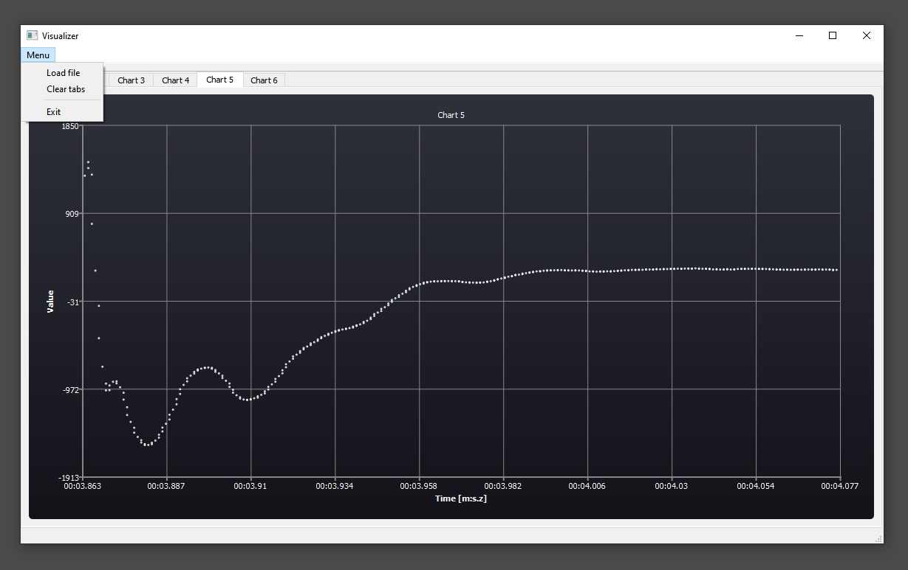

# Visualizer COMTRADE

The application enables visualization of data from a selected "* .DAT" file, which is a record of the registration in the COMTRADE format. The application allows you to zoom in and out of the graph using the +/- buttons, and to shift along the axis using the arrows.

